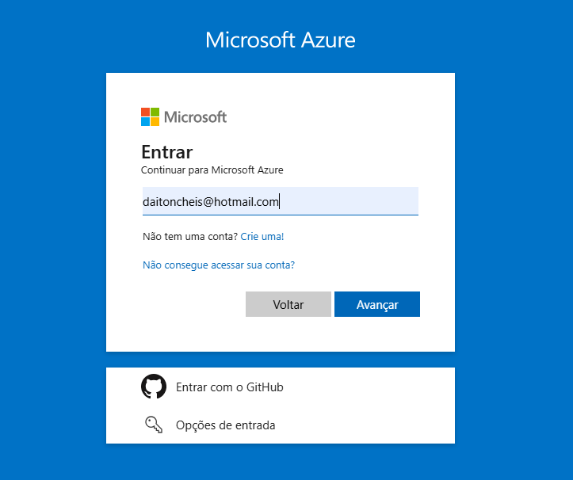

# Desafio DIO: Máquina Virtual no Microsoft Azure

Este repositório documenta a criação e configuração de uma Máquina Virtual (VM) na plataforma Microsoft Azure, como parte do desafio do curso de Cloud com IA da DIO. O objetivo é registrar o processo e os aprendizados.

## 🎯 Objetivos

* Praticar a criação e configuração de VMs no Azure.
* Documentar etapas técnicas de forma clara.
* Utilizar o GitHub para compartilhamento.

## 💻 Processo de Criação da Máquina Virtual no Azure

### 1. **Acesso e Login no Portal do Azure**

Acesse `portal.azure.com` e faça login.

### 2. **Iniciando a Criação da VM**

Busque por "Máquinas virtuais" no portal e clique em "+ Criar" > "Máquina virtual".

### 3. **Configurações Básicas**

Defina os detalhes principais da sua VM:

* **Assinatura:** `Azure for Students`.
* **Grupo de Recursos:** Novo (`minha-vm-dio_group`).
* **Nome da VM:** `minha-vm-dio`.
* **Região:** `South America - Brazil South`.
* **Zona de Disponibilidade:** `Zona auto-selecionada (Zona 1)`.
* **Tipo de Segurança:** `Computadores virtuais de inicialização confiável`.
* **Imagem (SO)::** `Windows Server 2019 Datacenter - x64 Gen2`.
* **Tamanho:** `Standard_D2s_v3 (2 vCPUs, 8 GiB memória)`.
* **Conta de Administrador:** Defina `Nome de usuário` (`adminuser`) e `Senha`.

### 4. **Configurações de Discos**

No separador "Discos", mantive as opções padrão, com `SSD Premium` para o disco do SO e a opção de `Excluir com VM` ativada.

### 5. **Configurações de Rede**

No separador "Rede", o Azure configurou automaticamente a VNet, sub-rede e IP público. Para acesso, permiti a porta `RDP (3389)`.

**Atenção:** Permitir RDP diretamente na internet é recomendado **apenas para testes**.

### 6. **Revisar e Criar**

Na guia "Revisar + criar", validei as configurações e cliquei em "Criar".

### 7. **Aguardar Implantação e Acessar a VM**

Após clicar em "Criar", a VM será provisionada (leva alguns minutos). Ao concluir, acesse a visão geral da VM e use o **IP público** para conectar-se via **Conexão de Área de Trabalho Remota (RDP)** com suas credenciais.

